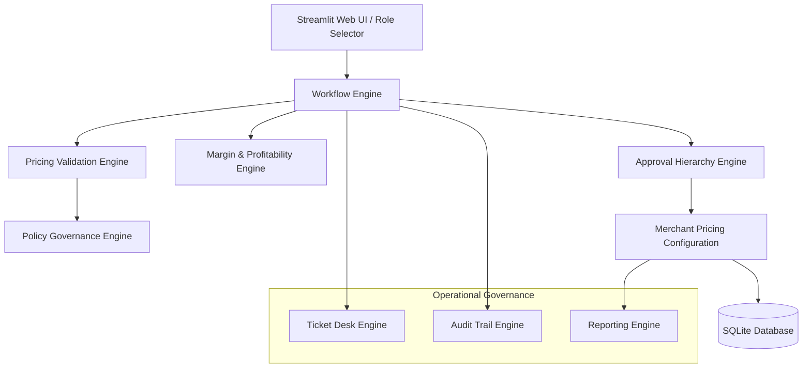
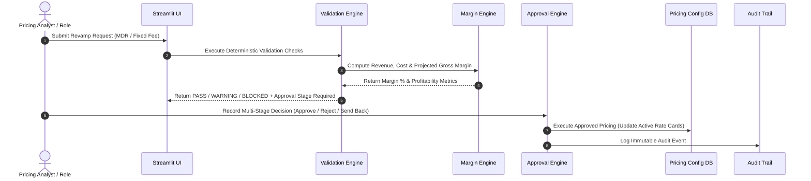

# Merchant Pricing Operations & Approval Platform
**Fintech Pricing Operations Simulation**

[](https://merchant-pricing-operations-platform-cby35zsvsfqzuywnpskch4.streamlit.app/)
[](https://www.python.org/)
[](LICENSE)
[](tests/)

🌐 **Live Streamlit App:** [https://merchant-pricing-operations-platform-cby35zsvsfqzuywnpskch4.streamlit.app/](https://merchant-pricing-operations-platform-cby35zsvsfqzuywnpskch4.streamlit.app/)

---

> ### ⚠️ **DISCLAIMER**
> **"Fintech Pricing Operations Simulation"**  
> This project is a realistic portfolio simulation of a fintech Finance Operations / Pricing Operations platform built for demonstration, portfolio, and analytical purposes.  
> **It is NOT affiliated with, connected to, sponsored by, or endorsed by Razorpay, Salesforce, Freshdesk, or any real commercial banking or payment gateway systems.**  
> All merchant names, IDs, transaction volumes, rate cards, and financial figures used in this application are completely fictional synthetic demo data.

---

## 📌 Executive Summary & Business Problem

In high-volume payment processing platforms, merchant pricing changes (MDR percentage, fixed per-transaction fees, minimum/maximum fee caps) represent a critical financial control point. Unvalidated price cuts compress operating margins or create loss-making payment flows. Conversely, delayed pricing approvals lead to merchant churn.

The **Merchant Pricing Operations & Approval Platform** provides internal pricing analysts, banking operations, checkers, and function heads with a deterministic governance engine, multi-level approval hierarchy, real-time margin/profitability calculator, service desk workflow, and immutable audit trail.

---

## 🏗️ Architecture & Control Flow



### Data Pipeline Sequence



---

## 👑 Role-Based Access Control (RBAC) Matrix

| Simulated Role | System Authority & Permissions |
| :--- | :--- |
| **Pricing Analyst** | Create requests, edit drafts, submit proposals, view request queue & analytics |
| **POC Reviewer** | Review completeness & approve/send back `POC_REVIEW` stage requests |
| **Banking Operations** | Add network/acquiring bank cost assumptions & approve `BANKING_MARGIN_VALIDATION` stage |
| **Checker** | Operational check & approve `CHECKER_REVIEW` stage requests |
| **Function Head** | Executive sign-off for high-risk requests (`>20% MDR cut` or `Margin < 5%`) |
| **Operations Admin** | Full access to all stages, policy threshold management, and database reset |

---

## 🚀 Core Platform Capabilities

1. **Merchant Pricing Configuration**: Active rate card management across payment methods (**Cards**, **UPI Recurring**, **E-Mandate**, **Optimiser**).
2. **Pricing Revamp Request Lifecycle**: Request generation (`PR-2026-XXXX`), draft editing, justification attachment, real-time pre-submission validation.
3. **Deterministic Validation Engine**: Checks required fields, MDR range [0.0%, 5.0%], fixed fee bounds, duplicate pending requests, merchant status (Active vs Suspended / Under Review), and effective dates.
4. **Margin & Profitability Engine**: Computes current vs proposed revenue, interchange/network cost, bank acquiring fees, gateway processing fees, gross margin %, and monthly/annualized financial impacts.
5. **Pricing Risk Classification**: Classifies requests into `LOW RISK`, `MEDIUM RISK`, `HIGH RISK`, and `CRITICAL` with clear reasoning.
6. **SOP & Policy Governance Engine**: Configurable thresholds (MDR drop limits, margin floor limits, GMV high-scrutiny limits).
7. **Multi-Level Approval Hierarchy**: Stage-gated review chain (`POC Review` → `Banking Ops Margin Validation` → `Checker Review` → `Function Head Approval` → `Execution`).
8. **Ticket & Service Workflow Desk**: Internal ticketing simulation (`TKT-2026-XXXX`) with team routing, priority tagging, and case comments.
9. **SLA Tracking**: Turnaround time tracking with status badges (`🟢 Within SLA`, `🟡 SLA At Risk`, `🔴 SLA Breached`).
10. **Immutable Audit Trail**: Complete event history explorer (`REQUEST_CREATED`, `POC_APPROVED`, `BANKING_APPROVED`, `CHECKER_APPROVED`, `PRICING_EXECUTED`).
11. **Operations Dashboard**: Executive KPIs and Plotly charts (status split, payment method mix, risk distribution, merchant tiers).
12. **Operational Reports**: Downloadable CSV reports for pricing requests, active rate cards, margin impacts, approvals, SLA performance, and audit logs.

---

## 🧮 Profitability Engine Formulas

The platform enforces transparent, non-hidden financial calculations:

$$\text{Current Revenue} = (\text{GMV} \times \frac{\text{Current MDR}}{100}) + (\text{Tx Count} \times \text{Current Fixed Fee})$$

$$\text{Proposed Revenue} = (\text{GMV} \times \frac{\text{Proposed MDR}}{100}) + (\text{Tx Count} \times \text{Proposed Fixed Fee})$$

$$\text{Processing Cost} = (\text{GMV} \times \frac{\text{Network Fee \%} + \text{Bank Fee \%}}{100}) + (\text{Tx Count} \times (\text{Proc Fixed} + \text{Ops Fixed}))$$

$$\text{Projected Gross Margin} = \text{Proposed Revenue} - \text{Processing Cost}$$

$$\text{Projected Margin \%} = \frac{\text{Projected Gross Margin}}{\text{Proposed Revenue}} \times 100$$

$$\text{Monthly Revenue Impact} = \text{Proposed Revenue} - \text{Current Revenue}$$

$$\text{Annualized Revenue Impact} = \text{Monthly Revenue Impact} \times 12$$

---

## 💻 Local Setup & Installation

### Prerequisites
- Python 3.11+
- Git

### Installation Steps

```bash
# 1. Clone Repository
git clone https://github.com/Dhanya562004/merchant-pricing-operations-platform.git
cd "merchant-pricing-operations-platform"

# 2. Create Virtual Environment
python -m venv venv
# On Windows PowerShell:
.\venv\Scripts\Activate.ps1
# On macOS/Linux:
source venv/bin/activate

# 3. Install Dependencies
pip install -r requirements.txt

# 4. Run Application
streamlit run app.py
```

Open your browser at `http://localhost:8501`.

---

## 🧪 Automated Testing

Execute the comprehensive automated test suite (25 tests):

```bash
pytest -v
```

### Test Coverage Areas:
- Pricing engine & delta calculations (`test_pricing_engine.py`)
- Financial margin & loss-making detection (`test_margin_engine.py`)
- Deterministic validation engine & policy rules (`test_validation_engine.py`)
- Workflow state machine & execution eligibility (`test_workflow.py`)
- Approval hierarchy & role gating (`test_approval_engine.py`)
- Ticket workflow & audit trail logging (`test_ticket_and_audit.py`)

---

## 🎬 Step-by-Step Interview Demonstration Workflow

1. **Role Switcher**: In the sidebar, select **Demo Role: Pricing Analyst**.
2. **Create Revamp Request**: Go to **Pricing Requests Workbench** → **Create New Pricing Revamp Request**. Select `Aura Retail Pvt Ltd (MERCH-1001)` for `Cards`. Set proposed MDR to `1.65%` (down from 1.85%). Observe the real-time pre-submission validation preview indicating **WARNING (Checker Approval Required)**. Click **Submit Pricing Revamp Request**.
3. **Margin Analysis**: Open **Margin & Profitability Analysis**. Select the newly created request. Adjust network cost to `1.10%` and click **Save Banking Cost Assumptions**. Observe the monthly and annualized revenue impact metrics and financial waterfall chart.
4. **Role Gated Approval**: Switch Demo Role in the sidebar to **POC Reviewer**. Go to **Approval Hierarchy Workbench**, select the request, enter reviewer comments, and click **Submit Approval Decision (APPROVE)**. Notice the request advances to `BANKING_MARGIN_VALIDATION`.
5. **Checker Review**: Switch Demo Role to **Banking Operations**, approve the stage. Then switch Demo Role to **Checker**, approve the final review. Request advances to `READY_FOR_EXECUTION`.
6. **Pricing Execution**: In **Approval Hierarchy Workbench** → **Ready for Execution** tab, click **Execute Pricing Change in Production**.
7. **Verification**: Go to **Merchant Pricing Configuration** to verify that the merchant's active rate card has been updated to `1.65%`, and inspect **Audit Trail Explorer** to see the immutable `PRICING_EXECUTED` log record.

---

## 📄 Resume Bullet Points (Based Strictly on Implemented Capabilities)

- **Engineered a Merchant Pricing Operations Platform** using Python, Streamlit, and SQLite to automate merchant rate card revamp lifecycles, policy enforcement, and multi-level approval hierarchies across Cards, UPI Recurring, E-Mandate, and Optimiser payment methods.
- **Built a Deterministic Validation & Profitability Engine** computing gross margin %, network interchange fees, and annualized financial impacts in real time, automatically blocking loss-making deals and routing high-risk requests to Checker and Function Head stages based on configurable SOP rules.
- **Implemented an Enterprise Service Workflow & Audit Desk** featuring Salesforce-style ticket routing, SLA countdown status tracking (`🟢 Within SLA`, `🟡 At Risk`, `🔴 Breached`), and immutable event logging, validated by a 25-test automated pytest suite.
